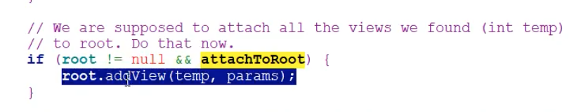
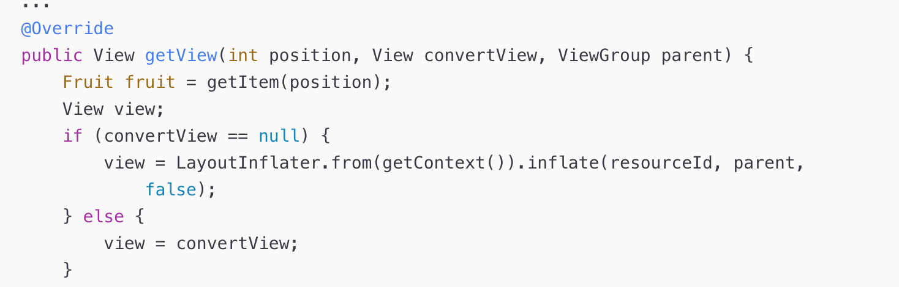
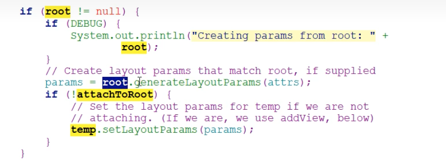

#### LayoutInflater.inflate 使用不当的问题
#### 参数说明
* @Nullable ViewGroup root
* boolean attachToRoot 
	* Whether the inflated hierarchy should be attached to the root parameter? If false, root is only used to create the correct subclass of LayoutParams for the root view in the XML.


* 如果root不为null 并且attachToRoot为true，那么给加载的布局文件指定一个父布局（root.addView(布局文件))

* 如果root不为null，并且attacheToRoot为false，那么就把root的LayoutParams设置给布局文件的最外层
* 如果root == null，无论attachToRoot 是否ture还是false， ResourceId的根节点没有依赖的父布局（容器），所以width和height**属性失效**

这里可以回顾下ListView的Adapter的使用：



默认的Layout最外层（根节点）的属性配置不生效，只有inflate之后，基于parent构建后，才会将属性赋值给最外层的View。看如下代码：
```java
LayoutInflate.inflate(XmlPullParser parser, @Nullable ViewGroup root, boolean attachToRoot) 
```


#### 不正确的参数
* ViewPager设置warp_content无效，需要自定义ViewPager，此时要注意PageAdapter中构建View的逻辑